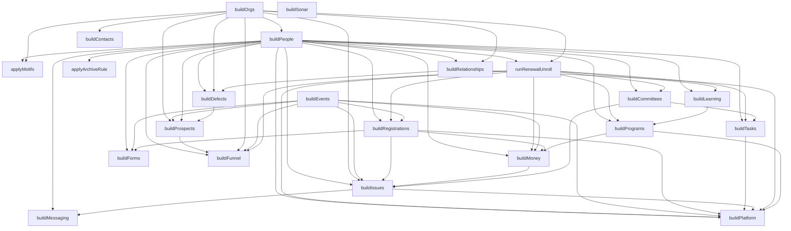

# The pipeline

Generated by `node cli/emit-pipeline.mjs` from `projects/morecheese/index.mjs`. Do not edit —
the suite fails if this file and the code disagree.

**22 stages, in the order they run.** Arrows are dependencies the argument lists make
unavoidable: a stage cannot run before something it takes as input exists.

## Order, and what each stage produces

| # | stage | produces |
|---|---|---|
| 1 | `buildOrgs` | `orgs` |
| 2 | `buildPeople` | `people` |
| 3 | `applyMotifs` | `motifs` |
| 4 | `runRenewalUnroll` | `periods`, `renewalEvents` |
| 5 | `applyArchiveRule` | `archived` |
| 6 | `buildEvents` | `events` |
| 7 | `buildRegistrations` | `registrations` |
| 8 | `buildLearning` | `learning` |
| 9 | `buildPrograms` | `programs` |
| 10 | `buildMoney` | `money` |
| 11 | `buildCommittees` | `committees` |
| 12 | `buildForms` | `forms` |
| 13 | `buildRelationships` | `relationships` |
| 14 | `buildTasks` | `tasks` |
| 15 | `buildIssues` | `issues` |
| 16 | `buildMessaging` | `messaging` |
| 17 | `buildDefects` | `defects` |
| 18 | `buildProspects` | `prospects` |
| 19 | `buildFunnel` | `funnel` |
| 20 | `buildContacts` | `contacts` |
| 21 | `buildPlatform` | `platform` |
| 22 | `buildSonar` | `sonar` |

## The edges nothing enforces

The arrows above are free — JavaScript will not let you consume what does not exist yet. These are
the other kind: a stage **mutates** something a later stage reads, so the argument lists look
identical whichever order you choose, and swapping them compiles, runs, and quietly produces
different data.

Declared in `projects/morecheese/pipeline.mjs` and checked by the suite.

**`applyMotifs` → `runRenewalUnroll`**
motifs stamp _lapseYear onto people, and the unroll reads it as a PINNED outcome. Both take `people`, so nothing enforces the order — run the unroll first and every stamped archetype silently loses its story.

**`applyMotifs` → `buildRegistrations`**
motifs write _thetaPath (an authored engagement arc). Every downstream domain that scores on engagement reads it, and reads a flat _theta instead if motifs have not run.

**`applyMotifs` → `buildLearning`**
same _thetaPath dependency: a rising star who has not risen yet takes courses like anyone else.

**`applyMotifs` → `buildCommittees`**
same _thetaPath dependency: committee volunteering scores on the arc, not the anchor.

**`buildDefects` → `buildPlatform`**
defects REWRITE relationship edges (the true-employer correction) and mutate emails in place. Platform mirrors those timelines in its audit rows, so running it first records history that the finished world does not contain.

**`buildRelationships` → `buildDefects`**
defects append true-employer edges to the relationships array, so relationships must exist as an array first. Visible in the argument list today, declared here because the DIRECTION is the load-bearing part: defects mutate, they do not receive a copy.

*(Verified: swapping `applyMotifs` and `runRenewalUnroll` — a two-line edit the comments do not
object to — changes committee memberships, attendance, motions and more. The check names it.)*
